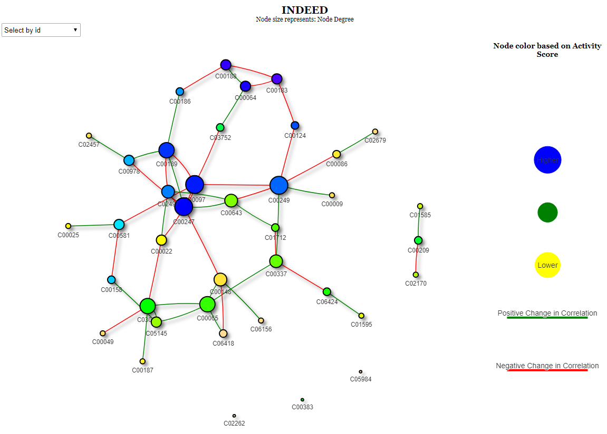
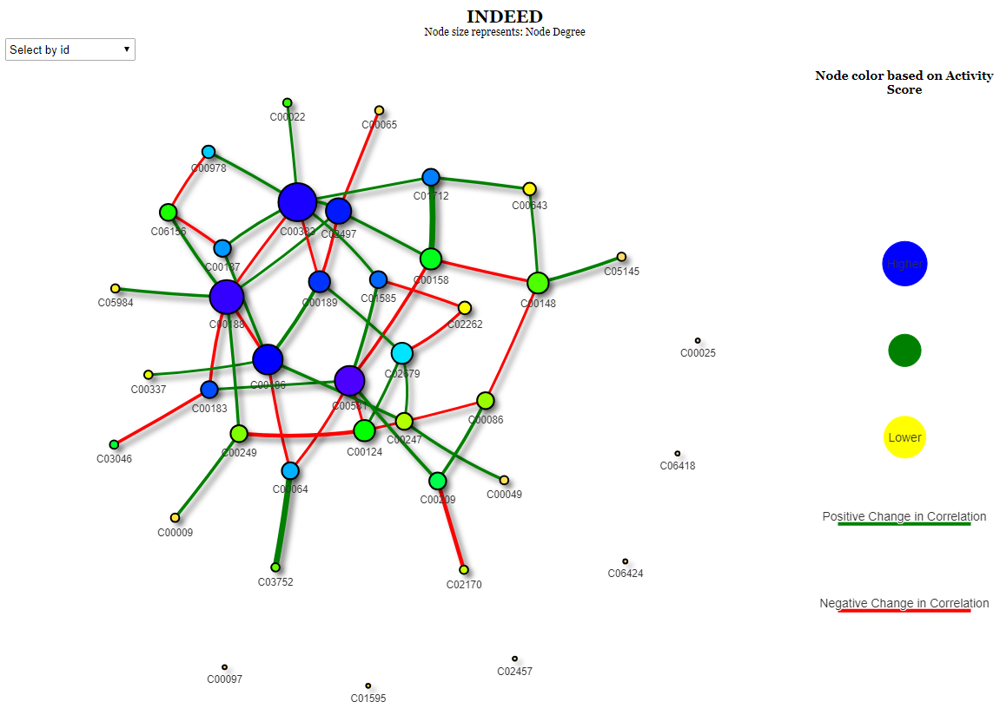

<!-- README.md is generated from README.Rmd. Please edit that file -->

```{r, echo = F}
knitr::opts_chunk$set(
  collapse = TRUE,
  comment = "#>",
  fig.path = "figure/"
)
```

# INDEED
## Overview

This R package implements INDEED algorithm from Zuo *et. al.*'s Methods paper, INDEED: Integrated differential expression and differential network analysis of omic data for biomarker discovery ([PMID: 27592383](https://www.ncbi.nlm.nih.gov/pubmed/?term=27592383%5Buid%5D)). 

This R package will generate a list of dataframes containing information such as p-value, node degree and activity score for each biomolecule. A higher activity score indicates that the corresponding biomolecule has more neighbors connected in the differential network and their p-values are more statistically significant. It will also generate a network display to aid users' biomarker selection.

## Installation

You can install INDEED from github with:

```{r, eval = F}
# install.packages("devtools")
devtools::install_github("ressomlab/INDEED")
```

## Load package

Load the package.

```{r, eval = T}
# load INDEED
library(INDEED)
```

## Examples

A testing dataset has been provided to the users to get familiar with INDEED R package. It contains the expression levels of 39 metabolites from 120 subjects (CIRR: 60; HCC: 60) with CIRR group named as group 0 and HCC group named as group 1.

```{r, eval = T}
# Data matrix contains the expression levels of 39 metabolites from 120 subjects 
# (6 metabolites and 10 subjects are shown)
head(Met_GU[, 1:10])
# Group label for each subject (40 subjects are shown)
Met_Group_GU[1:40]
# Metabolite KEGG IDs (10 metabolites are shown)
Met_name_GU[1:10]
```

An example to obtain the differential network using partial correlation analysis.

```{r rho-selection, eval = T}
# set seed to avoid randomness
set.seed(100)
# Compute rho values to run graphical lasso
pre_data <- select_rho_partial(data = Met_GU, class_label = Met_Group_GU, id = Met_name_GU, error_curve = TRUE)
```

From the error curve figure, users can choose the rho value based on the minimum rule (red vertical line), the one standard error rule (blue horizontal line) or their preferred value. INDEED provides users the option to adjust multiple testing effect in edge detection (fdr = TRUE). This will lead to a more sparse network in general. In this example, the network is too sparse. We decide to set fdr = FALSE for demonstration. It's a good idea to start by setting fdr = TRUE and later relax it to fdr = FALSE if the network is too sparse when working on a new dataset.

```{r, eval = T, results = 'hide'}
# Choose optimal rho values to compute activity scores and build the differential network
result <- partial_cor(data_list = pre_data, rho_group1 = 'min', rho_group2 = "min", p_val = pvalue_M_GU, permutation = 1000, permutation_thres = 0.05, fdr = FALSE)
```

Show the network display and users can interact with it.

```{r, eval = T}
# Show result 
head(result$activity_score)
head(result$diff_network)
# Show network
network_display(result = result, nodesize= 'Node_Degree', nodecolor= 'Activity_Score', edgewidth= FALSE, layout= 'nice')
```

<!-- Network display image was generated from somewhere else -->

<!-- -->

An example to obtain the differential network using correlation analysis. When the partial correlation analysis returns a too sparse network even when the multiple testing correction is turned off (fdr = FALSE). It's better to try correlation analysis.

```{r, eval = T, results = 'hide'}
# set seed to avoid randomness
set.seed(100)
# Compute rho values to run graphical lasso
result <- non_partial_cor(data = Met_GU, class_label = Met_Group_GU, id = Met_name_GU, method = "pearson", p_val = pvalue_M_GU, permutation = 1000, permutation_thres = 0.05, fdr = FALSE)
```

Show the network display and users can interact with it. Here, edgewidth is assigned to the significance level of the differential connection (z-score of edge connection with different colors for positive or negative changes).

```{r, eval = T}
# Show result 
head(result$activity_score)
head(result$diff_network)
# Show network
network_display(result = result, nodesize= 'Node_Degree', nodecolor= 'Activity_Score', edgewidth= TRUE, layout= 'nice')
```

<!-- Network display image was generated from somewhere else -->

<!-- -->
