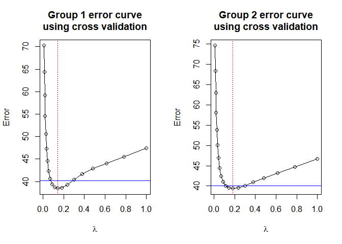

<!-- README.md is generated from README.Rmd. Please edit that file -->

# INDEED

## Overview

This package implements INDEED algorithm from Zuo *et. al.*’s Methods
paper, INDEED: Integrated differential expression and differential
network analysis of omic data for biomarker discovery
([PMID: 27592383](https://www.ncbi.nlm.nih.gov/pubmed/?term=27592383%5Buid%5D)).

This R package will generate a list of dataframes containing information
such as p-value, node degree and activity score for each biomolecule. A
higher activity score indicates that the corresponding biomolecule has
more neighbors connected in the differential network and their p-values
are more statistically significant. It will also generate a network
display to aid users’ biomarker selection.

## Installation

You can install INDEED from github with:

``` r
# install.packages("devtools")
devtools::install_github("ressomlab/INDEED")
```

## Usage

Load the package.

``` r
# load INDEED
library(INDEED)
#> Loading required package: glasso
```

A testing dataset has been provided to the users to get familiar with
INDEED package. It contains the expression levels of 39 metabolites from
120 subjects (CIRR: 60; HCC: 60) with CIRR group named as group 0 and
HCC group named as group
1.

``` r
# Data matrix contains the expression levels of 39 metabolites from 120 subjects 
# (6 metabolites and 10 subjects are shown)
head(Met_GU[, 1:10])
#>            X1         X2         X3        X4          X5         X6
#> 1 -1.17784288 -0.6524507  0.1130101 0.3273883 -0.81597223 0.91690985
#> 2 -0.74465547 -0.8403552  1.2275791 1.4884276  0.95811649 0.22175791
#> 3  1.02005243  1.6526556  0.4660893 1.4657142  1.15495800 0.66656520
#> 4  0.40435337  0.4216086  0.3728297 0.4413724  0.41055731 0.39239917
#> 5  1.27026847  1.5406950 -0.1213972 1.0226981 -1.41568157 0.02338627
#> 6  0.04855234  0.6102747  1.0018852 0.8012087  0.03375084 0.29277059
#>            X7          X8         X9        X10
#> 1 -0.10606357 -0.14868927 -0.7536426  1.9331369
#> 2  0.57873922 -0.04059911 -0.3448051 -0.3943420
#> 3 -0.02235966 -0.25240024  0.6314481 -0.2927764
#> 4  0.34483591  0.64974659  0.3820917  0.3832617
#> 5  2.19089662 -0.80789325  0.1743634  1.2832645
#> 6  0.20963886  0.25854132  0.8692107 -0.5259235
# Group label for each subject (40 subjects are shown)
Met_Group_GU[1:40]
#>   X1 X2 X3 X4 X5 X6 X7 X8 X9 X10 X11 X12 X13 X14 X15 X16 X17 X18 X19 X20
#> 1  0  0  0  0  0  0  0  0  0   0   0   0   0   0   0   0   0   0   0   1
#>   X21 X22 X23 X24 X25 X26 X27 X28 X29 X30 X31 X32 X33 X34 X35 X36 X37 X38
#> 1   1   1   1   1   1   1   1   1   1   1   1   1   1   1   1   1   1   1
#>   X39 X40
#> 1   1   1
# Metabolite KEGG IDs (10 metabolites are shown)
Met_name_GU[1:10]
#>  [1] "C00009" "C00022" "C00025" "C00049" "C00064" "C00065" "C00086"
#>  [8] "C00097" "C00124" "C00148"
```

An example to obtain the differential network using partial correlation
analysis.

``` r
# set seed to avoid randomness
set.seed(100)
# Compute rho values to run graphical lasso
pre_data <- select_rho_partial(data = Met_GU, class_label = Met_Group_GU, id = Met_name_GU, error_curve = "YES")
```



From the error curve figure, users can choose the rho value based on the
minimum rule (red vertical line), the one standard error rule (blue
horizontal line) or their preferred
value.

``` r
# Choose optimal rho values to compute activity scores and build the differntial network
result <- partial_cor(data_list = pre_data, rho_group1 = 'min', rho_group2 = "min", permutation = 1000, p_val = pvalue_M_GU, permutation_thres = 0.05)
```

Show the network display and users can interact with it.

``` r
# Show result 
head(result$activity_score)
#>   Node     ID P_value Node_Degree Activity_Score
#> 1   12 C00183   0.000           9           13.1
#> 2   39 C06424   0.707           9           11.6
#> 3   24 C00978   0.166           7           11.0
#> 4   34 C03752   0.624           6           10.0
#> 5    3 C00025   0.997          12            9.8
#> 6   16 C00189   0.016           7            9.7
head(result$diff_network)
#>   Node1 Node2 Binary       Weight
#> 1     1     2      1  0.025153682
#> 2     1     5      1  0.012438623
#> 3     1    19      1  0.026422667
#> 4     1    28      1  0.007233308
#> 5     1    32      1  0.005578263
#> 6     2     3     -1 -0.012646624
# Show network
network_display(result)
```


