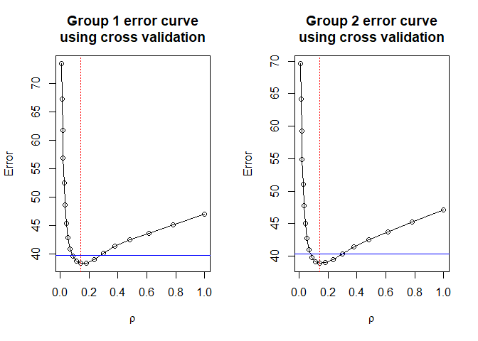
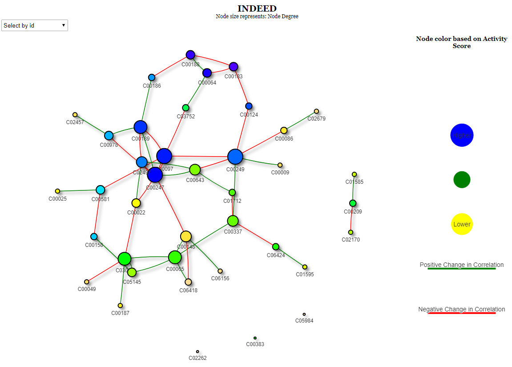
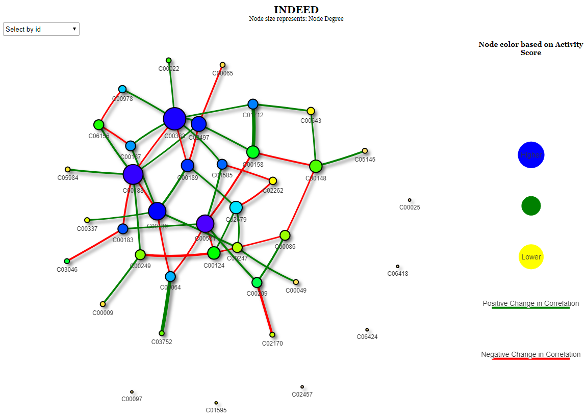

<!-- README.md is generated from README.Rmd. Please edit that file -->

# INDEED

## Overview

This R package implements INDEED algorithm from Zuo *et. al.*’s Methods
paper, INDEED: Integrated differential expression and differential
network analysis of omic data for biomarker discovery ([PMID:
27592383](https://www.ncbi.nlm.nih.gov/pubmed/?term=27592383%5Buid%5D)).

This R package will generate a list of dataframes containing information
such as p-value, node degree and activity score for each biomolecule. A
higher activity score indicates that the corresponding biomolecule has
more neighbors connected in the differential network and their p-values
are more statistically significant. It will also generate a network
display to aid users’ biomarker selection.

## Installation

You can install INDEED from github with:

``` r
# install.packages("devtools")
devtools::install_github("ressomlab/INDEED")
```

## Load package

Load the package.

``` r
# load INDEED
library(INDEED)
#> Loading required package: glasso
```

## Examples

A testing dataset has been provided to the users to get familiar with
INDEED R package. It contains the expression levels of 39 metabolites
from 120 subjects (CIRR: 60; HCC: 60) with CIRR group named as group 0
and HCC group named as group 1.

``` r
# Data matrix contains the expression levels of 39 metabolites from 120 subjects 
# (6 metabolites and 10 subjects are shown)
head(Met_GU[, 1:10])
#>            X1         X2         X3        X4          X5         X6
#> 1 -1.17784288 -0.6524507  0.1130101 0.3273883 -0.81597223 0.91690985
#> 2 -0.74465547 -0.8403552  1.2275791 1.4884276  0.95811649 0.22175791
#> 3  1.02005243  1.6526556  0.4660893 1.4657142  1.15495800 0.66656520
#> 4  0.40435337  0.4216086  0.3728297 0.4413724  0.41055731 0.39239917
#> 5  1.27026847  1.5406950 -0.1213972 1.0226981 -1.41568157 0.02338627
#> 6  0.04855234  0.6102747  1.0018852 0.8012087  0.03375084 0.29277059
#>            X7          X8         X9        X10
#> 1 -0.10606357 -0.14868927 -0.7536426  1.9331369
#> 2  0.57873922 -0.04059911 -0.3448051 -0.3943420
#> 3 -0.02235966 -0.25240024  0.6314481 -0.2927764
#> 4  0.34483591  0.64974659  0.3820917  0.3832617
#> 5  2.19089662 -0.80789325  0.1743634  1.2832645
#> 6  0.20963886  0.25854132  0.8692107 -0.5259235
# Group label for each subject (40 subjects are shown)
Met_Group_GU[1:40]
#>   X1 X2 X3 X4 X5 X6 X7 X8 X9 X10 X11 X12 X13 X14 X15 X16 X17 X18 X19 X20 X21
#> 1  0  0  0  0  0  0  0  0  0   0   0   0   0   0   0   0   0   0   0   1   1
#>   X22 X23 X24 X25 X26 X27 X28 X29 X30 X31 X32 X33 X34 X35 X36 X37 X38 X39 X40
#> 1   1   1   1   1   1   1   1   1   1   1   1   1   1   1   1   1   1   1   1
# Metabolite KEGG IDs (10 metabolites are shown)
Met_name_GU[1:10]
#>  [1] "C00009" "C00022" "C00025" "C00049" "C00064" "C00065" "C00086" "C00097"
#>  [9] "C00124" "C00148"
```

An example to obtain the differential network using partial correlation
analysis.

``` r
# set seed to avoid randomness
set.seed(100)
# Compute rho values to run graphical lasso
pre_data <- select_rho_partial(data = Met_GU, class_label = Met_Group_GU, id = Met_name_GU, error_curve = TRUE)
```

<!-- -->

From the error curve figure, users can choose the rho value based on the
minimum rule (red vertical line), the one standard error rule (blue
horizontal line) or their preferred value. INDEED provides users the
option to adjust multiple testing effect in edge detection (fdr = TRUE).
This will lead to a more sparse network in general. In this example, the
network is too sparse. We decide to set fdr = FALSE for demonstration.
It’s a good idea to start by setting fdr = TRUE and later relax it to
fdr = FALSE if the network is too sparse when working on a new dataset.

``` r
# Choose optimal rho values to compute activity scores and build the differential network
result <- partial_cor(data_list = pre_data, rho_group1 = 'min', rho_group2 = "min", p_val = pvalue_M_GU, permutation = 1000, permutation_thres = 0.05, fdr = FALSE)
```

Show the network display and users can interact with it.

``` r
# Show result 
head(result$activity_score)
#>   Node     ID P_value Node_Degree Activity_Score
#> 1   12 C00183   0.000           3            8.2
#> 2   15 C00188   0.487           3            8.1
#> 3    5 C00064   0.015           3            7.7
#> 4   18 C00247   0.889           6            6.4
#> 5    8 C00097   0.578           6            6.0
#> 6   16 C00189   0.016           5            6.0
head(result$diff_network)
#>   Node1 Node2 Binary    Weight
#> 1     1    19      1  2.290368
#> 2     2     8     -1 -2.290368
#> 3     2    31      1  2.226212
#> 4     2    33     -1 -4.635348
#> 5     3    22      1  2.033520
#> 6     4    33     -1 -2.457263
# Show network
network_display(result = result, nodesize= 'Node_Degree', nodecolor= 'Activity_Score', edgewidth= FALSE, layout= 'nice')
```

<!-- Network display image was generated from somewhere else -->

<!-- -->

An example to obtain the differential network using correlation
analysis. When the partial correlation analysis returns a too sparse
network even when the multiple testing correction is turned off (fdr =
FALSE). It’s better to try correlation analysis.

``` r
# set seed to avoid randomness
set.seed(100)
# Compute rho values to run graphical lasso
result <- non_partial_cor(data = Met_GU, class_label = Met_Group_GU, id = Met_name_GU, method = "pearson", p_val = pvalue_M_GU, permutation = 1000, permutation_thres = 0.05, fdr = FALSE)
```

Show the network display and users can interact with it. Here, edgewidth
is assigned to the significance level of the differential connection
(z-score of edge connection with different colors for positive or
negative changes).

``` r
# Show result 
head(result$activity_score)
#>   Node     ID P_value Node_Degree Activity_Score
#> 1   22 C00581   0.074           5           11.9
#> 2   15 C00188   0.487           5           10.0
#> 3   31 C02497   0.537           5            8.6
#> 4   21 C00383   0.001           5            8.5
#> 5   13 C00186   0.388           5            7.8
#> 6   16 C00189   0.016           3            7.2
head(result$diff_network)
#>   Node1 Node2 Binary    Weight
#> 1     1    19      1  2.512144
#> 2     4    18      1  2.326348
#> 3     5    13     -1 -2.197286
#> 4     5    22     -1 -2.033520
#> 5     5    34      1  4.635348
#> 6     6    31     -1 -2.257129
# Show network
network_display(result = result, nodesize= 'Node_Degree', nodecolor= 'Activity_Score', edgewidth= TRUE, layout= 'nice')
```

<!-- Network display image was generated from somewhere else -->

<!-- -->
